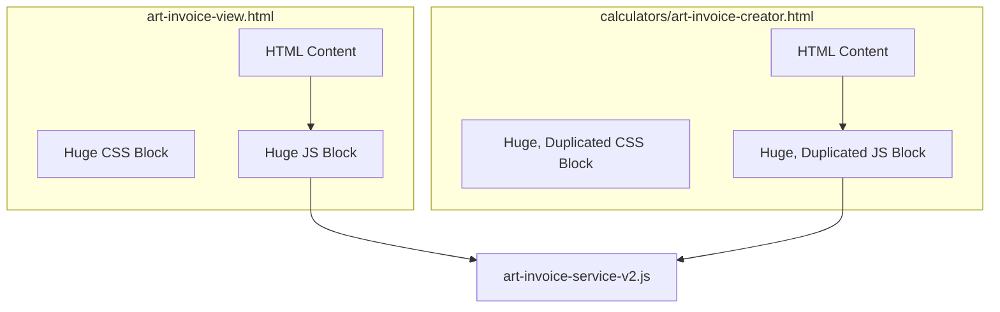
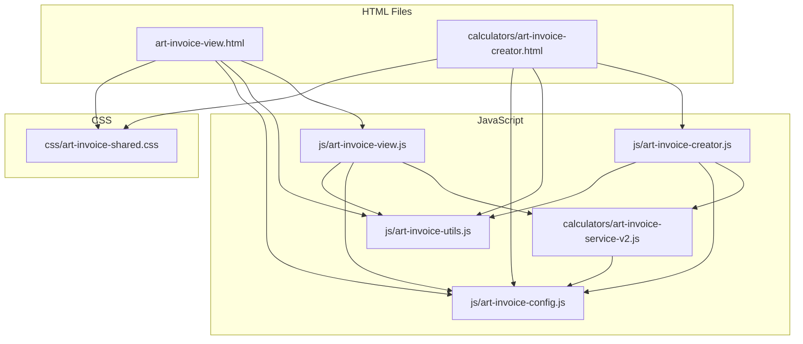

# Art Invoice - Refactoring Deep Dive

**To:** Junior Developer
**From:** Your Senior Dev Partner

Welcome. You've been tasked with cleaning up the Art Invoice application, and you've been given a solid plan. My goal here is to expand on that plan, providing you with the "why" behind each step and the specific details to execute this refactor with precision and confidence.

Think of this as untangling a knot. Right now, everything is jumbled together. By the end of this, everything will have its own place, making the entire system drastically easier to manage, debug, and upgrade.

### The "Before" Picture: A Tangled Mess

Here’s a conceptual look at our current setup. Everything is crammed into the HTML files, making it hard to see where one thing ends and another begins.



Our goal is to clean this up, creating separate, organized files for each concern.

---

## Phase 1: Unifying the Styles (CSS Extraction)

**The "Why":** Right now, if you want to change a button color, you have to do it in two different files. If you forget one, the app looks inconsistent. This is a maintenance nightmare. By moving all CSS to a single file, we create a **Single Source of Truth**. Change it once, and it changes everywhere.

### Step-by-Step Guide:

1.  **Create the CSS Folder and File:**
    *   Create a new folder in the root directory named `css`.
    *   Inside that `css` folder, create a new file named `art-invoice-shared.css`.

2.  **Move and Merge the Styles:**
    *   Open `art-invoice-view.html`. Copy the entire content from inside the `<style>` tags (from line 19 to 948) and paste it into `art-invoice-shared.css`.
    *   Open `calculators/art-invoice-creator.html`. Copy its CSS content (from inside its `<style>` tags).
    *   Now, carefully paste this second block of CSS at the end of `art-invoice-shared.css`. Your code editor will likely highlight the duplicated rules. The most important one to find and delete is the massive, repeated `@media print` section. Delete the second instance of it entirely. For any other smaller duplicated rules, merge them so you only have one version of each rule.

3.  **Link the New Stylesheet:**
    *   In both `art-invoice-view.html` and `calculators/art-invoice-creator.html`, **delete the entire `<style>` block**.
    *   In the `<head>` section of `art-invoice-view.html`, add this line:
        ```html
        <link rel="stylesheet" href="css/art-invoice-shared.css">
        ```
    *   In the `<head>` section of `calculators/art-invoice-creator.html`, add this line (note the `../` path):
        ```html
        <link rel="stylesheet" href="../css/art-invoice-shared.css">
        ```

### Verification:

*   Open both HTML files in your browser. They should look **exactly** as they did before.
*   Check the print preview on both pages. The layout should be consistent and professional.

---

## Phase 2: Building Your Toolbox (`art-invoice-utils.js`)

**The "Why":** The "Don't Repeat Yourself" (DRY) principle is a programmer's best friend. Both of our HTML files have identical JavaScript functions for handling the artwork modal, formatting dates, etc. If we find a bug in the modal code, we'd have to fix it in two places. By creating a shared "utilities" file, we fix it once.

**Crucial Concept:** We are **not** using modern `import`/`export`. The `onclick` attributes in the HTML need to find their functions (`showArtworkModal()`, etc.) in the global browser scope. The beautiful thing is, a simple `<script>` tag does this for us automatically! Any function in `art-invoice-utils.js` will be globally available to any other script loaded after it.

### Step-by-Step Guide:

1.  **Create the JS Folder and File:**
    *   Create a new folder in the root directory named `js`.
    *   Inside that `js` folder, create a new file named `art-invoice-utils.js`.

2.  **Identify and Move Duplicated Functions:**
    *   Look in both `art-invoice-view.html` and `calculators/art-invoice-creator.html`. Find these functions:
        *   `hasArtwork()`
        *   The entire "Artwork Modal System": `showArtworkModal()`, `createArtworkModal()`, `closeArtworkModal()`, `downloadArtwork()` and any related gallery functions.
        *   `formatDate()`
        *   `getSalesRepName()`, `getSalesRepEmail()`, `getSalesRepFirstName()` (Even if only in one file, they are utility functions and belong here).
    *   Copy **one** version of each of these functions and paste them into `js/art-invoice-utils.js`.

3.  **Link the Toolbox and Clean Up:**
    *   In `art-invoice-view.html`, find the main `<script>` tag (around line 1160). **Delete** the functions you just moved from this block.
    *   In `calculators/art-invoice-creator.html`, do the same. **Delete** the duplicated functions from its main `<script>` block.
    *   Now, in the `<head>` of **both** HTML files, add the following line. **It must go before the page-specific script.**
        ```html
        <!-- In art-invoice-view.html -->
        <script src="js/art-invoice-utils.js"></script>

        <!-- In calculators/art-invoice-creator.html (note the path) -->
        <script src="../js/art-invoice-utils.js"></script>
        ```

### Verification:

*   Open both pages. The artwork gallery modal **must** open and function correctly on both.
*   Dates and Sales Rep names must display correctly.

---

## Phase 3: Logic Separation (Page-Specific JS)

**The "Why":** Our HTML files shouldn't be responsible for application logic. HTML is for structure and content. JavaScript is for behavior and logic. Separating them makes the code cleaner and easier to reason about.

### Step-by-Step Guide:

1.  **Create the Page-Specific Files:**
    *   In the `js` folder, create `art-invoice-view.js`.
    *   In the `js` folder, create `art-invoice-creator.js`.

2.  **Move the Remaining JavaScript:**
    *   Go back to `art-invoice-view.html`. Cut **all remaining JavaScript** from its `<script>` tag and paste it into `js/art-invoice-view.js`. The `<script>` tag in the HTML file should now be empty.
    *   Repeat this for `calculators/art-invoice-creator.html`, moving its remaining script content into `js/art-invoice-creator.js`.

3.  **Link the New Scripts:**
    *   In `art-invoice-view.html`, replace the now-empty `<script>` tag with:
        ```html
        <script src="js/art-invoice-view.js"></script>
        ```
    *   In `calculators/art-invoice-creator.html`, replace its empty `<script>` tag with:
        ```html
        <script src="../js/art-invoice-creator.js"></script>
        ```

### Verification:

This is the most critical phase. Test everything.
*   **Creator Page:**
    *   Can you search for and select an art request?
    *   Does the form populate correctly?
    *   Does the live preview on the right update as you make changes?
    *   Can you submit the form and create an invoice?
*   **View Page:**
    *   Does an existing invoice load correctly?
    *   Do the Print and Email buttons work?

---

## Phase 4: The Configuration File (`art-invoice-config.js`)

**The "Why":** Hard-coding business rules (like prices) into logic files is risky. When the `hourlyRate` changes from $75 to $85, you shouldn't have to hunt through a logic file. A configuration file puts all these important, changeable values in one easy-to-find place.

### Step-by-Step Guide:

1.  **Create the Config File:**
    *   In the `js` folder, create a new file named `art-invoice-config.js`.

2.  **Create the Global Config Object:**
    *   In `art-invoice-config.js`, add the following code. This creates a single, global object to hold our settings.
        ```javascript
        var AppConfig = {
            hourlyRate: 75.00,
            rushMultiplier: 1.25,
            serviceCodes: {
                'GRT-25': { name: 'Quick Review', amount: 25.00 },
                'GRT-50': { name: 'Logo Mockup', amount: 50.00 },
                'GRT-75': { name: 'Custom Design', amount: 75.00 },
                'GRT-100': { name: 'Extended Design', amount: 100.00 },
                'GRT-150': { name: 'Complex Project', amount: 150.00 },
                'GRT-ADD25': { name: 'Additional Design Time', amount: 25.00, isAdditional: true },
                'GRT-ADD50': { name: 'Extended Design Work', amount: 50.00, isAdditional: true },
                'GRT-REV3': { name: 'Excessive Revisions', amount: 50.00, isAdditional: true },
                'GRT-REDO': { name: 'Complete Design Redo', amount: 75.00, isAdditional: true }
            }
        };
        ```

3.  **Refactor `art-invoice-service-v2.js`:**
    *   Open `calculators/art-invoice-service-v2.js`.
    *   **Delete** the `this.hourlyRate`, `this.rushMultiplier`, and the entire `this.serviceCodes` object from the `constructor`.
    *   Use `Find and Replace` in your editor.
        *   Find all instances of `this.hourlyRate` and replace them with `AppConfig.hourlyRate`.
        *   Find all instances of `this.serviceCodes` and replace them with `AppConfig.serviceCodes`.

4.  **Link the Config Script (Load Order is CRITICAL):**
    *   This script must be loaded **FIRST**, so other scripts can access the `AppConfig` object. In the `<head>` of both HTML files, add the script tag at the very top of your other scripts.

    *   The final script order in `art-invoice-view.html` should be:
        ```html
        <script src="js/art-invoice-config.js"></script>
        <script src="calculators/art-invoice-service-v2.js"></script>
        <script src="js/art-invoice-utils.js"></script>
        <script src="js/art-invoice-view.js"></script>
        ```
    *   The final script order in `calculators/art-invoice-creator.html` should be:
        ```html
        <script src="../js/art-invoice-config.js"></script>
        <script src="art-invoice-service-v2.js"></script>
        <script src="../js/art-invoice-utils.js"></script>
        <script src="../js/art-invoice-creator.js"></script>
        ```

### Verification:
*   Open the Invoice Creator page.
*   Select a service from a dropdown. The correct price from `AppConfig` should populate.
*   Verify that all calculations still work correctly.

---

## The "After" Picture: Clean and Organized

Once you're done, our project structure will be logical and easy to understand. This is the sign of a professional, maintainable application.


You've got this. Follow these steps, take your time, and test at each phase. Let me know when you're ready to proceed.