# API Endpoints Documentation

_Last Updated: July 8, 2025_
_Total Endpoints: 52_

This document provides a comprehensive list of all API endpoints used in the application, organized by service area. This documentation is maintained as part of the API consolidation project (Phase 5) and includes endpoints across Art Invoice System, Production Schedule, Pricing, Orders, User Management, and Utility Services.

## Base URLs

- Production API: `https://caspio-pricing-proxy-ab30a049961a.herokuapp.com/api`
- Development API: `http://localhost:3000/api`
- Caspio API: `https://c3eku948.caspio.com/integrations/rest/v3`

## API Architecture Overview

```mermaid
graph TD
    Client[Client Application]
    
    subgraph Core Services
        PS[Production Schedule]
        AI[Art Invoices]
        AR[Art Requests]
        PR[Pricing]
        PROD[Products]
    end
    
    subgraph Order Management
        QM[Quote Management]
        ORD[Orders]
        CART[Cart]
    end
    
    subgraph Embellishments
        EM[Embroidery]
        SP[Screen Print]
        DTG[DTG Printing]
        DTF[DTF Printing]
    end
    
    subgraph User Management
        AUTH[Authentication]
        PROF[User Profile]
        PREF[Preferences]
    end
    
    subgraph Utils
        UP[Upload]
        SHIP[Shipping]
        SEARCH[Search]
    end
    
    Client --> PS
    Client --> AI
    Client --> AR
    Client --> PR
    Client --> PROD
    Client --> QM
    Client --> ORD
    Client --> CART
    Client --> EM
    Client --> SP
    Client --> DTG
    Client --> DTF
    Client --> AUTH
    Client --> PROF
    Client --> PREF
    Client --> UP
    Client --> SHIP
    Client --> SEARCH
```



## Art Invoice System

### Art Requests
- **GET** `/api/artrequests`
  - **Purpose**: Get list of art requests
  - **Query Parameters**:
    - `pk_id`: Filter by primary key
    - `id_design`: Filter by design ID
    - `status`: Filter by status
    - `companyName`: Filter by company
    - `customerServiceRep`: Filter by CSR
    - `salesRep`: Filter by sales rep
    - `invoiced`: Filter by invoice status
    - `limit`: Limit results
  - **Response Fields**:
    - `PK_ID`: Primary key
    - `ID_Design`: Design identifier
    - `CompanyName`: Customer company
    - `NOTES`: Request notes
    - `Invoiced`: Invoice status

- **GET** `/api/artrequests/:id`
  - **Purpose**: Get single art request
  - **Used In**: Art Invoice Service

- **PUT** `/api/artrequests/:id`
  - **Purpose**: Update art request
  - **Used For**: Marking requests as invoiced
  - **Request Body Example**:
    ```json
    {
      "Invoiced": true,
      "Invoiced_Date": "2025-07-08T13:46:55",
      "Invoice_Updated_Date": "2025-07-08T13:46:55",
      "Note_Mockup": "Invoiced with ID: ART-52503"
    }
    ```

### Art Invoices
- **GET** `/api/art-invoices`
  - **Purpose**: Get list of invoices
  - **Query Parameters**:
    - `invoiceID`: Filter by invoice ID
    - `artRequestID`: Filter by art request ID
    - `status`: Filter by status (e.g., "Draft", "Sent", "Paid")
    - `artistEmail`: Filter by artist
    - `customerEmail`: Filter by customer
    - `limit`: Limit results

- **POST** `/api/art-invoices`
  - **Purpose**: Create new invoice
  - **Request Body Example**:
    ```json
    {
      "idDesign": "52503",
      "artRequestID": "52503",
      "customerName": "Test Customer",
      "customerCompany": "Test Company",
      "customerEmail": "test@example.com",
      "projectName": "API Test Project",
      "projectType": "Design",
      "timeSpent": 2.5,
      "hourlyRate": 75,
      "rushFee": 25,
      "notes": "Created via API test",
      "artworkDescription": "Test artwork",
      "fileReferences": "TEST-REF-001",
      "complexity": "Medium"
    }
    ```

- **GET** `/api/art-invoices/:id`
  - **Purpose**: Get single invoice
  - **Response Fields**:
    - `InvoiceID`: Invoice identifier (e.g., "ART-52503")
    - `Status`: Invoice status
    - `CustomerName`: Client name
    - `GrandTotal`: Total amount
    - `PaymentAmount`: Amount paid
    - `BalanceDue`: Remaining balance

- **PUT** `/api/art-invoices/:id`
  - **Purpose**: Update invoice
  - **Used For**: Status updates, payment recording
  - **Request Body Example**:
    ```json
    {
      "Status": "Updated via API Test",
      "Notes": "Updated through API test"
    }
    ```

### Invoice Statistics
- **GET** `/api/art-invoices/stats`
  - **Purpose**: Get invoice statistics
  - **Response Fields**:
    ```json
    {
      "total": 100,
      "draft": 20,
      "sent": 40,
      "paid": 30,
      "overdue": 10,
      "totalAmount": 15000.00,
      "totalPaid": 12000.00,
      "totalDue": 3000.00
    }
    ```

### Advanced Operations
- **POST** `/api/art-invoices/:id/payment`
  - **Purpose**: Record payment for invoice
  - **Request Body**:
    ```json
    {
      "amount": 100.00,
      "method": "Credit Card",
      "reference": "TEST-PAY-123",
      "modifiedBy": "API Test"
    }
    ```

- **POST** `/api/art-invoices/:id/reminder`
  - **Purpose**: Send payment reminder
  - **Updates**: Increments reminder count and sets last reminder date

- **POST** `/api/art-invoices/check-overdue`
  - **Purpose**: Check and update overdue statuses
  - **Process**: Updates status to "Overdue" for unpaid invoices past due date

- **GET** `/api/art-invoices/search`
  - **Purpose**: Search invoices
  - **Query Parameters**:
    - `term`: Search term (e.g., company name, invoice ID)
  - **Response**: List of matching invoices with basic details

## Production Schedule

### Schedule Management
- **GET** `/tables/Production_Schedules/records`
  - **Base URL**: `https://c3eku948.caspio.com/integrations/rest/v3`
  - **Query Parameters**:
    - `q.orderBy`: Sort order (e.g., "Date DESC")
    - `q.limit`: Limit results
  - **Authentication**: Bearer token required
  - **Used In**: Production schedule dashboard
  - **Cache Duration**: 1 hour
  - **Response Fields**:
    - `PK_ID`: Primary key identifier
    - `ID_Log`: Unique log identifier
    - `Date`: Schedule update timestamp
    - `Employee`: Who updated the schedule
    - `DTG`: Direct-to-Garment availability date
    - `Embroidery`: Embroidery availability date
    - `Cap_Embroidery`: Cap embroidery availability date
    - `Screenprint`: Screen printing availability date
    - `Transfers`: Transfer printing availability date
    - `Comment_DTG`: DTG-specific notes
    - `Comment_Emb`: Embroidery notes
    - `Comment_Cap`: Cap embroidery notes
    - `Comment_SP`: Screen print notes
    - `Comment_Transfers`: Transfer notes

### Production Schedule Proxy
- **GET** `/api/production-schedule/latest`
  - **Purpose**: Get latest production schedule
  - **Returns**: Current availability for all decoration methods
  - **Cache**: 1 hour (both client and server-side)
  - **Used In**: Staff dashboard
  - **Response Format**:
    ```json
    {
      "lastUpdated": "September 1, 2021",
      "updatedBy": "Ruth",
      "production": [
        {
          "method": "DTG",
          "displayDate": "Available Sept 10",
          "daysOut": 9,
          "isRush": false,
          "tooltip": "2 weeks out"
        }
      ],
      "capacity": {
        "current": "100-200 Prints",
        "rushAvailable": true
      }
    }
    ```
  - **Features**:
    - Smart date display ("Available Now", "Available Tomorrow", etc.)
    - Rush order availability calculation
    - Capacity parsing from comments
    - Error handling with fallback to cached data

## Pricing System

### Matrix Pricing
- **GET** `/api/pricing/matrix`
  - **Purpose**: Retrieves pricing matrix data
  - **Configuration**:
    - Cache: Enabled (1 hour TTL)
    - Retry: Enabled (3 attempts)

### Price Calculation
- **GET** `/api/pricing/calculate`
  - **Purpose**: Calculates pricing for individual items
  - **Used In**: Various pricing calculators

### Bulk Price Calculation
- **POST** `/api/pricing/bulk-calculate`
  - **Purpose**: Calculates pricing for multiple items simultaneously

### Pricing Tiers
- **GET** `/api/pricing/tiers`
  - **Purpose**: Retrieves pricing tier information
  - **Query Parameters**:
    - `method`: Decoration method (e.g., "DTG")
  - **Used In**: `test-dtg-tier-debug.html`

## Quote System

### Quote Management
- **GET** `/api/quotes`
  - **Purpose**: List quotes
  - **Used In**: `test-quote-api-integration.html`

- **POST** `/api/quotes`
  - **Purpose**: Create new quote
  - **Configuration**:
    - Cache: Disabled
    - Offline Queueing: Enabled

### Quote Items
- **GET** `/api/quote_items`
  - **Purpose**: Get quote items
  - **Used In**: `test-quote-api-integration.html`

### Quote Analytics
- **GET** `/api/quote_analytics`
  - **Purpose**: Get quote analytics
  - **Used In**: `test-quote-api-integration.html`

### Quote Sessions
- **GET** `/api/quote_sessions`
  - **Purpose**: Get quote sessions
  - **Used In**: 
    - `test-api-direct.html`
    - `test-cap-embroidery-quote-integration.html`

## Embellishment Services

### Embroidery
- **POST** `/api/embellishments/embroidery/calculate`
  - **Purpose**: Calculate embroidery pricing
- **POST** `/api/embellishments/embroidery/validate`
  - **Purpose**: Validate embroidery parameters
- **GET** `/api/embellishments/embroidery/estimate-stitches`
  - **Purpose**: Estimate stitch count

### Screen Print
- **POST** `/api/embellishments/screen-print/calculate`
  - **Purpose**: Calculate screen printing pricing
- **POST** `/api/embellishments/screen-print/validate`
  - **Purpose**: Validate screen print parameters

### DTG (Direct to Garment)
- **POST** `/api/embellishments/dtg/calculate`
  - **Purpose**: Calculate DTG printing pricing
- **POST** `/api/embellishments/dtg/validate`
  - **Purpose**: Validate DTG parameters
- **GET** `/api/embellishments/dtg/check-compatibility`
  - **Purpose**: Check garment compatibility for DTG

### DTF (Direct to Film)
- **POST** `/api/embellishments/dtf/calculate`
  - **Purpose**: Calculate DTF printing pricing
- **POST** `/api/embellishments/dtf/validate`
  - **Purpose**: Validate DTF parameters

## Product Management

### Products
- **GET** `/api/products`
  - **Purpose**: List all products
  - **Configuration**:
    - Cache: Enabled (5 minutes TTL)
    - Retry: Enabled

- **GET** `/api/products/:id`
  - **Purpose**: Get product details

- **GET** `/api/products/search`
  - **Purpose**: Search products

- **GET** `/api/products/categories`
  - **Purpose**: List product categories

- **GET** `/api/products/:id/inventory`
  - **Purpose**: Get product inventory levels

- **GET** `/api/products/:id/colors`
  - **Purpose**: Get available colors for product

- **GET** `/api/products/:id/sizes`
  - **Purpose**: Get available sizes for product

## Order Management

### Orders
- **GET** `/api/orders`
  - **Purpose**: List orders

- **POST** `/api/orders`
  - **Purpose**: Create new order
  - **Configuration**:
    - Cache: Disabled
    - Retry: Enabled (5 attempts)
    - Offline Queue: Enabled
    - Priority: High

- **GET** `/api/orders/:id`
  - **Purpose**: Get order details

- **PUT** `/api/orders/:id`
  - **Purpose**: Update order

- **POST** `/api/orders/:id/cancel`
  - **Purpose**: Cancel order

- **GET** `/api/orders/:id/tracking`
  - **Purpose**: Get order tracking information

### Cart
- **GET** `/api/cart`
  - **Purpose**: Get cart contents

- **POST** `/api/cart/items`
  - **Purpose**: Add item to cart

- **PUT** `/api/cart/items/:itemId`
  - **Purpose**: Update cart item

- **DELETE** `/api/cart/items/:itemId`
  - **Purpose**: Remove item from cart

- **POST** `/api/cart/clear`
  - **Purpose**: Clear cart

- **POST** `/api/cart/checkout`
  - **Purpose**: Process checkout

## User Management

### Authentication
- **POST** `/api/auth/login`
  - **Purpose**: User login
  - **Configuration**:
    - Cache: Disabled
    - Retry: Disabled
    - Offline Queue: Disabled

- **POST** `/api/auth/logout`
  - **Purpose**: User logout

- **POST** `/api/auth/refresh`
  - **Purpose**: Refresh authentication token

- **POST** `/api/auth/register`
  - **Purpose**: Register new user

- **POST** `/api/auth/forgot-password`
  - **Purpose**: Initiate password reset

- **POST** `/api/auth/reset-password`
  - **Purpose**: Complete password reset

### User Profile
- **GET** `/api/user/profile`
  - **Purpose**: Get user profile

- **GET** `/api/user/preferences`
  - **Purpose**: Get user preferences

- **GET** `/api/user/addresses`
  - **Purpose**: Get user addresses

- **GET** `/api/user/quotes`
  - **Purpose**: Get user's saved quotes

- **GET** `/api/user/orders`
  - **Purpose**: Get user's order history

## Utility Services

### File Upload
- **POST** `/api/utils/upload`
  - **Purpose**: Upload files

### Search
- **GET** `/api/utils/search`
  - **Purpose**: Global search

- **GET** `/api/utils/autocomplete`
  - **Purpose**: Autocomplete suggestions

### Address & Shipping
- **POST** `/api/utils/validate-address`
  - **Purpose**: Validate shipping address

- **POST** `/api/utils/calculate-shipping`
  - **Purpose**: Calculate shipping costs

## Email Integration

### Email Notifications
- **POST** `/api/art-invoices/:id/send`
  - **Purpose**: Send invoice email to customer
  - **Template**: `art_invoice`
  - **Variables**:
    - `invoice_id`: Invoice ID (e.g., ART-52503)
    - `customer_name`: Customer's name
    - `customer_company`: Customer's company
    - `customer_email`: Customer's email
    - `amount_art_billed`: Total invoice amount
    - `service_code`: Service code (e.g., GRT-50)
    - `service_description`: Description of service
    - `due_date`: Invoice due date
    - `sales_rep_name`: Sales representative name
    - `sales_rep_email`: Sales rep email
    - `artist_name`: Artist name

- **POST** `/api/art-invoices/:id/send-reminder`
  - **Purpose**: Send payment reminder email
  - **Template**: `art_invoice_reminder`
  - **Variables**:
    - `invoice_id`: Invoice ID
    - `customer_name`: Customer's name
    - `company_name`: Customer's company
    - `amount_due`: Amount still due
    - `due_date`: Original due date
    - `days_overdue`: Number of days overdue
    - `sales_rep_name`: Sales representative name
    - `sales_rep_email`: Sales rep email
    - `sales_rep_phone`: Phone number

- **POST** `/api/art-requests/:id/send-approval-reminder`
  - **Purpose**: Send artwork approval reminder
  - **Template**: `art_approval_reminder`
  - **Variables**:
    - `id_design`: Design ID number
    - `company_name`: Customer's company
    - `customer_name`: Customer's name
    - `days_waiting`: Number of working days waiting
    - `request_date`: Original request date
    - `artist_name`: Artist name
    - `sales_rep_name`: Sales representative name
    - `sales_rep_email`: Sales rep email
    - `sales_rep_phone`: Phone number

### Email Configuration
- **GET** `/api/email/templates`
  - **Purpose**: Get list of available email templates
  - **Response**: List of template IDs and their variables

- **POST** `/api/email/test`
  - **Purpose**: Send test email using specified template
  - **Request Body**:
    ```json
    {
      "template_id": "art_invoice",
      "test_email": "test@example.com",
      "variables": {
        "invoice_id": "TEST-123",
        "customer_name": "Test Customer"
      }
    }
    ```

## System Health

### Health Check
- **GET** `/api/health`
  - **Purpose**: Monitor API system health
  - **Used In**: `test-api-connection-debug.html`

## Configuration Notes

### Caching Policy
- Most GET endpoints are cached by default (1 minute TTL)
- Pricing matrix is cached for 1 hour
- Production schedule is cached for 1 hour
- Authentication and order/quote mutations are never cached

### Retry Policy
- Default: 3 retry attempts
- Order operations: 5 retry attempts
- Authentication operations: No retries

### Offline Support
- Most operations support offline queueing
- Critical operations (orders, quotes) are queued with high priority
- Authentication operations do not support offline mode

### API Versioning
- Current version: v1
- All endpoints can be versioned using `/v1` or `/v2` prefix
- Example: `/v1/api/pricing/calculate`