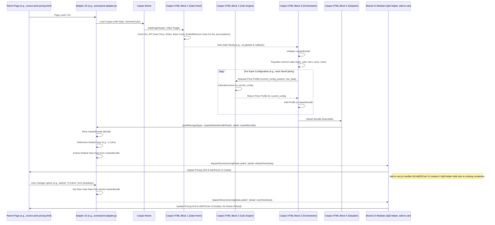

# Master Bundle Implementation Guide for Caspio-Driven Pricing Pages

## 1. Introduction & Goal

**Legacy Model (Typical):** Many Caspio DataPages calculate and send pricing data for one selected configuration (e.g., a single print location, a specific number of print colors) at a time to the parent HTML page via `postMessage`. Changing an option on the parent page often requires reloading the Caspio iframe with new URL parameters, which then sends back data for the new configuration.

**Goal: Implement a "Master Bundle" Approach**
The objective is to refactor pricing mechanisms to adopt a "master bundle" strategy. This guide outlines the principles and steps to achieve this, using the DTG pricing refactor as a primary example, and providing considerations for more complex scenarios like Screen Print pricing.

**Core Principles of the Master Bundle Approach:**

1.  **Comprehensive Calculation in Caspio:** The Caspio DataPage will calculate pricing for **all relevant permutations** of user-selectable options (e.g., all print locations for DTG; all combinations of "number of print colors" and "print locations" for Screen Print) upon its initial load.
2.  **Single Data Package:** This comprehensive data, including tier definitions, size headers, shared rules, and detailed price profiles for each permutation, is packaged into a single "master bundle" (a JSON object).
3.  **One-Time Dispatch:** Caspio sends this master bundle to the parent page using `window.postMessage` **once** after all calculations are complete.
4.  **Client-Side Updates on Parent Page:** The Parent Page (e.g., `dtg-pricing.html`, `screen-print-pricing.html`) and its JavaScript adapter (e.g., `dtg-adapter.js`, a future `screenprint-adapter.js`):
    *   Receives and stores this master bundle.
    *   Initially displays pricing for a default configuration.
    *   When the user changes an option (e.g., selects a different print location or number of colors from a dropdown), the parent page uses the **stored master bundle to locally and instantly update** the displayed pricing. This occurs **without reloading the Caspio iframe**.

## 2. Benefits of Master Bundle Approach

*   **Improved User Experience:** Significantly faster, often instantaneous, UI updates when changing pricing-related options after the initial page load.
*   **Reduced Iframe Reloads:** Eliminates the visual disruption and delay of the iframe reloading for each option change.
*   **Reduced Server/API Load (Potentially):** If Caspio performs complex calculations or multiple API calls per configuration, doing this once upfront for all configurations can be more efficient.
*   **Architectural Consistency:** Promotes a standardized and robust data flow pattern across different embellishment type pricing pages.
*   **Simplified Parent Page Logic:** Once the master bundle is received, the parent page's primary job is data selection and rendering, rather than orchestrating iframe reloads.

## 3. Key Components & "The Secret Recipe"

Successfully implementing the master bundle approach involves careful coordination between the Caspio DataPage and the parent HTML page's JavaScript.

### 3.1. Caspio DataPage Structure & Logic

The Caspio DataPage is responsible for the heavy lifting of data aggregation and calculation. This typically involves several HTML Blocks:

*   **HTML Block 1 (API/Data Fetch & Initial Parameter Handling):**
    *   **Responsibility:** Fetch all necessary raw data from external APIs or Caspio tables. This includes base item costs (e.g., per style/color/size), pricing tiers, business rules (e.g., rounding methods, LTM fees, setup fees), and costs specific to the embellishment method (e.g., DTG print costs per location, screen print costs per number of colors per tier).
    *   **Master Bundle Adaptation:** This block needs to fetch data comprehensively, not just for a single configuration passed via URL parameters. For example, for screen printing, it would fetch screen print costs for ALL possible numbers of colors (1-6) for both primary and additional locations.
    *   Store fetched data in global JavaScript variables within the Caspio environment (e.g., `window.dp8ApiTierData`, `window.dp8ApiSPCostsPrimary`).
    *   Handle initial URL parameters like `StyleNumber` and `COLOR` to set the context.
    *   **Crucial:** Ensure robust error handling for API fetches. If critical data fails to load, prevent further processing and display an error.

*   **HTML Block 2 (Price Calculation Engine):**
    *   **Responsibility:** Contains the core pricing logic. This script should be designed as a function or set of functions that can calculate a complete price profile for a *single, specific configuration*.
    *   **Parameters:** For DTG, this function might take `printLocationCode`. For Screen Print, it would take `numberOfColors` and `locationType` (e.g., 'primary', 'additional').
    *   **Logic:** Applies all relevant business rules, margins, and costs (fetched by Block 1) to the base item costs to derive the final prices for all quantity tiers and all applicable sizes for the given configuration.
    *   **Output:** Returns a structured price profile object for that specific configuration.

*   **HTML Block 3 (Master Bundle Orchestration & Assembly):**
    *   **Responsibility:** This is the central coordinator within Caspio.
    *   **Trigger:** Typically initiated after Block 1 has successfully fetched all data (e.g., via a callback or promise resolution) or on a `DataPageReady` event if initial parameters are sufficient.
    *   **Logic:**
        1.  Define all possible configurations. For DTG, this is an array of print location codes. For Screen Print, this would involve iterating through numbers of colors (1-6) and location types.
        2.  Initialize an empty `masterBundle` object (see Section 6 for structure).
        3.  Populate `masterBundle` with common data: `styleNumber`, `colorName`, `productTitle`, shared `tierData`, `uniqueSizes` for the product, and any global `pricingRules`.
        4.  Loop through each defined configuration:
            *   Call the price calculation engine (from Block 2) with the parameters for the current configuration.
            *   Store the returned price profile in the appropriate part of the `masterBundle` (e.g., `masterBundle.allLocationPrices[locationCode]` for DTG, or a nested structure like `masterBundle.screenPrintPrices[numColors].primary` for screen print).
        5.  Once all configurations are processed and the `masterBundle` is complete, call the dispatch function (from Block 4).

*   **HTML Block 4 (Data Dispatch & Caspio UI - Optional):**
    *   **Responsibility:** Sends the assembled `masterBundle` to the parent page and optionally updates any internal Caspio display tables for preview/debugging.
    *   **Dispatch Function:** A function (e.g., `dispatchMasterBundleToParent`) that takes the `masterBundle` and uses `parent.postMessage({ type: 'caspioDtgMasterBundleReady', detail: masterBundle }, 'YOUR_PARENT_DOMAIN_HERE');`.
        *   **Important:** Use a distinct `type` for each embellishment method's master bundle (e.g., `caspioDtgMasterBundleReady`, `caspioScreenPrintMasterBundleReady`).
    *   **Internal Caspio Table (Optional):** If you maintain a pricing table display within Caspio itself, this block would populate it, perhaps for a default configuration. For the master bundle approach, this internal table becomes less critical for the parent page's functionality.

*   **Page Footer (Initialization & Event Listeners):**
    *   Contains script to kick off the data fetching and master bundle assembly process (e.g., calling the main function in Block 1 or Block 3 on `DataPageReady`).
    *   For Caspio pages with internal controls (like the "Number of Colors" dropdown in the Screen Print XML), this is where event listeners are attached to those controls. In a master bundle scenario, these internal controls might only re-trigger a *display update* within Caspio itself if an internal preview table is used; they **do not** cause the master bundle to be re-calculated and re-sent for the parent page. The parent page relies on the initially sent complete bundle.

### 3.2. Parent Page JavaScript (Adapter - e.g., `dtg-adapter.js`, `screenprint-adapter.js`)

The adapter script on the parent HTML page is responsible for interacting with the Caspio iframe and managing the UI based on the master bundle.

*   **Message Handling (`handleCaspioMessage`):**
    *   Listens for `postMessage` events from the Caspio iframe.
    *   Specifically looks for the `type` corresponding to the master bundle (e.g., `caspioDtgMasterBundleReady`).
    *   When received, stores the entire `event.data.detail` (the master bundle) in a globally accessible variable (e.g., `window.dtgMasterPriceBundle`, `window.screenPrintMasterBundle`).
    *   Logs the receipt and structure of the bundle for debugging.

*   **Initial UI Population:**
    *   Once the master bundle is stored:
        1.  Determine the default configuration to display (e.g., first print location for DTG, 1-color print for Screen Print). This can be hardcoded, based on the first item in the bundle, or read from the initial state of parent page controls (like dropdowns).
        2.  Extract the relevant price profile for this default configuration from the stored master bundle.
        3.  Dispatch a standardized `pricingDataLoaded` event on the `window` object. The `event.detail` of this event should contain the data necessary for shared UI modules (`dp5-helper.js`, `add-to-cart.js`) to render the pricing grid and "Add to Cart" section. This data typically includes: `styleNumber`, `color`, `embellishmentType`, `headers` (for the current view), `prices` (for the current view), `tierData` (or `tiers`), and `uniqueSizes`.
        4.  Shared modules listen for `pricingDataLoaded` and update the UI.

*   **Handling User Option Changes (e.g., Dropdowns):**
    *   Event listeners are attached to parent page controls (e.g., `parent-dtg-location-select` dropdown, a future "number of screen print colors" dropdown).
    *   When an option changes:
        1.  Get the new selected value(s).
        2.  Retrieve the corresponding price profile from the **locally stored master bundle**. This is the key to instant updates.
        3.  Construct a new `event.detail` object for the `pricingDataLoaded` event, containing the data for this newly selected configuration.
        4.  Re-dispatch the `pricingDataLoaded` event. Shared UI modules will react and update the display.
        5.  **Crucially, do NOT reload the Caspio iframe.**

*   **Removing Iframe Reload Logic:** Any old logic that updated the Caspio iframe's `src` attribute to pass new parameters for recalculation is removed.

### 3.3. Shared JavaScript Modules & DOM Interaction

These modules are designed to be reusable across different pricing pages.

*   **`pricingDataLoaded` Event:** This custom event is the primary communication mechanism between the specific adapter and the shared UI modules. The adapter is responsible for populating `event.detail` with the correct slice of data from the master bundle for the currently selected user options.
*   **`dp5-helper.js`:**
    *   Listens for `pricingDataLoaded`.
    *   Updates the main pricing display table (e.g., `#custom-pricing-grid`) using the `headers` and `prices` from the event detail.
    *   **DOM Readiness for Add to Cart:** A critical lesson learned. `dp5-helper.js`'s `updateAddToCartSection` (or similar logic if refactored) should be very careful about DOM element existence.
        *   It should first check if the primary container for the Add to Cart size inputs (e.g., `#size-quantity-grid-container`) exists.
        *   If this container does *not* exist when `dp5-helper.js` is triggered by an early `pricingDataLoaded` event (often from the adapter after receiving the master bundle), `dp5-helper.js` should **bail out** of trying to create or populate the Add to Cart UI elements itself. This prevents it from creating orphaned elements or interfering with `add-to-cart.js`.
        *   If the container *does* exist, `dp5-helper.js` can proceed to ensure its direct child (e.g., `#size-quantity-grid`) exists (creating it if necessary *within* the parent container) and then populate it with size rows.
    *   Sets a flag like `window.addToCartInitialized = true;` only after it has successfully built its part of the UI, or if it detects the UI already exists.

*   **`add-to-cart.js` (and `product-quantity-ui.js`):**
    *   Also listens for `pricingDataLoaded`.
    *   Its `handlePricingDataReady` (or similar) function checks if the Add to Cart UI (size inputs, buttons) has already been initialized (e.g., by checking `window.addToCartInitialized` or its own internal flags and DOM elements).
    *   **If the UI is NOT initialized:**
        *   It takes responsibility for creating the *entire* Add to Cart UI structure. This typically involves `ProductQuantityUI.createSizeQuantityGrid()` (or `ProductQuantityUI.createQuantityMatrix()`) which should create `#size-quantity-grid-container` (or `#quantity-matrix-container`) and its inner content (`#size-quantity-grid` or `#quantity-matrix`).
        *   It then populates these elements based on `event.detail.uniqueSizes` and attaches all necessary event listeners.
        *   Sets its own `uiInitialized` flag and potentially `window.addToCartInitialized = true;`.
    *   **If the UI IS already initialized:** It primarily re-attaches listeners if necessary and updates dynamic price displays or cart totals.
    *   Ensures the correct container (`#size-quantity-grid-container` or `#quantity-matrix-container`) is visible and the other is hidden based on layout preference.

*   **Clear Ownership of UI Creation:** The "secret recipe" emphasizes that for the Add to Cart section, there should be a clear point where one script takes primary responsibility for the initial DOM creation. The DTG solution evolved to have `add-to-cart.js` (via `ProductQuantityUI`) be this primary creator if `dp5-helper.js` bails due to missing containers.

## 4. Detailed Refactoring Plan (General Steps)

This adapts the DTG plan into a more generic guide.

### Phase 1: Caspio DataPage Modifications

**Step 1.1: Define All Configuration Parameters**
*   In a Caspio HTML Block (e.g., Block 1 or a dedicated config block):
    *   Define all possible values for each user-selectable option that affects pricing.
    *   **DTG Example:** `const DTG_LOCATIONS = [{ code: 'LC', name: 'Left Chest' }, ...];`
    *   **Screen Print Example:**
        *   `const SP_NUMBER_OF_COLORS = [1, 2, 3, 4, 5, 6];`
        *   `const SP_LOCATION_TYPES = [{ code: 'PRIMARY', name: 'Primary Location'}, { code: 'ADDITIONAL', name: 'Additional Location'}];` (if pricing differs structurally beyond just cost values). Often, additional location costs are simpler and might not need a full "location type" iteration if the structure is just a lookup table based on number of colors and tier.

**Step 1.2: Refactor/Create Price Calculation Engine (e.g., in HTML Block 2)**
*   Design a core function that calculates a price profile for a *single, specific combination* of all relevant parameters.
    *   **DTG Example:** `calculateDtgPriceProfile(styleNumber, color, printLocationCode, baseItemCosts, dtgCosts, tierData, rulesData)`
    *   **Screen Print Example:** `calculateScreenPrintPriceProfile(styleNumber, color, numberOfColors, locationType, baseItemCosts, primarySpCosts, additionalSpCosts, tierData, rulesData)`
*   This function should return a structured object containing prices for all sizes and tiers for that specific configuration.

**Step 1.3: Master Bundle Orchestration & Assembly (e.g., in HTML Block 3)**
*   This script is the heart of the Caspio-side logic.
    *   Trigger after all raw data from Block 1 is fetched and validated.
    *   Initialize the `masterBundle` object (see Section 6 for structure examples).
    *   Populate common data into the `masterBundle` (style, color, product title, tier definitions, unique garment sizes, global rules like setup fees).
    *   **Iterate through all defined configurations:**
        *   **DTG:** Loop through `DTG_LOCATIONS`. Call `calculateDtgPriceProfile` for each. Store result in `masterBundle.allLocationPrices[locationCode]`.
        *   **Screen Print:**
            *   Loop through `SP_NUMBER_OF_COLORS` (1 to 6).
            *   Inside this loop, call `calculateScreenPrintPriceProfile` for the 'PRIMARY' location type with the current number of colors. Store this in a structure like `masterBundle.primaryLocationPricesByColor[numColors]`.
            *   Call `calculateScreenPrintPriceProfile` (or a specialized version) for 'ADDITIONAL' location costs for the current number of colors. Store this in `masterBundle.additionalLocationPricesByColor[numColors]`.
    *   Ensure all necessary data (base costs, print costs for the specific number of colors, rules) are passed to the calculation engine.
    *   Once the `masterBundle` is fully populated, call the dispatch function (Step 1.4).

**Step 1.4: Data Dispatch (e.g., in HTML Block 4 or end of Block 3)**
*   A function like `dispatchMasterBundle(bundleData, messageType)`:
    *   `parent.postMessage({ type: messageType, detail: bundleData }, 'YOUR_PARENT_DOMAIN_HERE');`
    *   Example `messageType`: `'caspioDtgMasterBundleReady'`, `'caspioScreenPrintMasterBundleReady'`.

**Step 1.5: Adjust URL Parameter Usage & Internal Caspio UI**
*   URL parameters like `PRINT_LOCATION` or `NUMBER_OF_COLORS` are no longer used by Caspio to *filter* the data it calculates for the master bundle. It calculates for *all*.
*   Internal Caspio UI elements (like dropdowns) become for convenience/debugging within Caspio only and do not affect the master bundle sent to the parent.

### Phase 2: Parent Page JavaScript Adapter Modifications

**Step 2.1: Update Message Handling (`handleCaspioMessage` in the adapter)**
*   Listen for the specific `messageType` of the master bundle.
*   Store the received `event.data.detail` (the master bundle) in a module-scoped or global variable (e.g., `currentMasterBundle`).

**Step 2.2: Initial UI Population by Adapter**
*   After `currentMasterBundle` is stored:
    1.  Determine the default configuration (e.g., default print location, default number of colors).
    2.  Extract the price profile for this default configuration from `currentMasterBundle`.
    3.  Prepare an `eventData` object for the `pricingDataLoaded` event, containing `headers`, `prices`, `tiers`, `uniqueSizes`, etc., relevant to this *specific default view*.
    4.  `window.dispatchEvent(new CustomEvent('pricingDataLoaded', { detail: eventData }));`

**Step 2.3: Refactor Parent Page Option Controls (Dropdowns, etc.)**
*   Event listeners on these controls will:
    1.  Get the new selected option(s).
    2.  Use these options to look up the corresponding price profile(s) from the **locally stored `currentMasterBundle`**.
    3.  Prepare a new `eventData` object for `pricingDataLoaded` with the data for this new view.
    4.  Re-dispatch `window.dispatchEvent(new CustomEvent('pricingDataLoaded', { detail: eventData }));`.
    5.  **NO IFRAME RELOAD.**

### Phase 3: Shared UI Module Adjustments (`dp5-helper.js`, `add-to-cart.js`)

*   **`pricingDataLoaded` Consumption:** These modules continue to listen for `pricingDataLoaded`. The key is that the `event.detail` will always represent the *currently selected view* as determined by the adapter.
*   **DOM Creation and Visibility (Recap of "Secret Recipe" for Add to Cart):**
    *   `dp5-helper.js` (if it attempts to create part of Add-to-Cart UI): Checks for `#size-quantity-grid-container`. If missing, it **bails** on UI creation for Add-to-Cart for that event cycle.
    *   `add-to-cart.js`: If its UI isn't initialized (checks its own flags and DOM), it calls `ProductQuantityUI` to create the *full* Add-to-Cart DOM structure (e.g., `#size-quantity-grid-container` and `#size-quantity-grid`). Sets `window.addToCartInitialized = true;`.
    *   This ensures one clear owner for the initial build of that section.
    *   Both scripts ensure the correct layout (grid vs. matrix) is visible and the other hidden.

## 5. Data Structure for Master Bundle (Conceptual Examples)

### 5.1. DTG Master Bundle (Simplified Recap)

```javascript
// From: Caspio, Type: 'caspioDtgMasterBundleReady'
{
    styleNumber: "PC61",
    color: "Red",
    productTitle: "Port & Company Core Cotton Tee",
    tierData: { /* ... Tier definitions ... */ },
    uniqueSizes: ["S", "M", "L", "XL", "2XL", "3XL"],
    allLocationPrices: {
        "LC": { locationName: "Left Chest", prices: { /* S: {tier: $}, M: {tier: $} ... */ } },
        "FF": { locationName: "Full Front", prices: { /* ... */ } }
        // ... other DTG locations
    },
    timestamp: "YYYY-MM-DDTHH:mm:ssZ"
}
```

### 5.2. Screen Print Master Bundle (More Complex Example)

```javascript
// From: Caspio, Type: 'caspioScreenPrintMasterBundleReady'
{
    styleNumber: "PC54",
    color: "Cardinal",
    productTitle: "Port & Company Core Cotton Tee",
    tierData: { /* ... Tier definitions, same for all SP ... */ },
    uniqueSizes: ["S", "M", "L", "XL", "2XL", "3XL", "4XL"], // All garment sizes
    pricingRules: {
        setupFeePerColor: 30.00,
        flashCharge: 2.00, // Example, if applicable per color after the first
        whiteBasePlateNote: "Dark shirts require a white base plate (counts as an extra color).",
        specialtyInkNote: "Extra $2.00/item for Reflective Ink or Polyester/Nylon prints."
        // ... other rules
    },
    // Pricing for the primary (first) print location
    // Keyed by number of colors
    primaryLocationPricing: {
        "1": { // 1 Color Print
            prices: { // size: { tier: price_garment_plus_1_color_print }
                "S":  { "24-47": 11.75, "48-71": 10.50, /* ... */ },
                "M":  { "24-47": 11.75, "48-71": 10.50, /* ... */ }
                // ... other sizes
            }
        },
        "2": { // 2 Color Print
            prices: { /* S: {tier: price_garment_plus_2_color_print}, ... */ }
        }
        // ... up to 6 colors
    },
    // Pricing for *additional* print locations
    // Keyed by number of colors for that additional print
    additionalLocationPricing: {
        "1": { // 1 Color Additional Print
            prices: { // tier: price_for_1_color_additional_print (no garment cost)
                "24-47": 2.50, "48-71": 2.00, /* ... */
            }
        },
        "2": { // 2 Color Additional Print
            prices: { /* tier: price_for_2_color_additional_print, ... */ }
        }
        // ... up to 6 colors
    },
    timestamp: "YYYY-MM-DDTHH:mm:ssZ"
}
```
**Note on Screen Print Structure:** The `additionalLocationPricing` might only need to be by tier and number of colors, as the garment cost is in `primaryLocationPricing`. The parent page would combine these if multiple locations are selected by the user (though the current `screen-print-pricing.html` doesn't show UI for selecting multiple locations yet, the bundle should support it).

## 6. Key Implementation Steps & "Secret Sauce" Summary

1.  **Caspio - Fetch ALL Raw Data First (Block 1):** Get all tiers, all rules, all base item costs (for all sizes of the style), and all embellishment-specific costs (e.g., screen print costs for 1 through 6 colors for primary AND additional locations) upfront. Store these in well-named global Caspio JS variables.
2.  **Caspio - Central Calculation Engine (Block 2):** A function that takes all relevant parameters (style, garment color, *specific embellishment config like numColors/locationCode*), and all the fetched raw data, and returns a clean price profile for *that single configuration*.
3.  **Caspio - Master Bundle Orchestrator (Block 3):**
    *   Iterates through every permutation of user-selectable options (e.g., for screen print: iterate 1 to 6 colors).
    *   For each permutation, calls the calculation engine from Block 2.
    *   Assembles all results into the `masterBundle` JSON. Include common data (tiers, sizes, rules) once at the top level.
4.  **Caspio - Dispatch (Block 4/End of 3):** `postMessage` the complete `masterBundle` with a unique `type`.
5.  **Parent Adapter - Store Bundle & Initial Display:**
    *   Receive and store the `masterBundle`.
    *   Select a default view (e.g., 1-color screen print, primary location).
    *   Extract data for this default view from the `masterBundle`.
    *   Dispatch `pricingDataLoaded` with this *specific view's data*.
6.  **Parent Adapter - Handle Option Changes (Dropdowns):**
    *   On change, get new option (e.g., user selects "3 colors").
    *   Look up the data for "3 colors" in the **stored `masterBundle`**.
    *   Dispatch `pricingDataLoaded` again with this new view's data. **No iframe reload.**
7.  **Shared Modules (`dp5-helper`, `add-to-cart`):**
    *   React to `pricingDataLoaded` to update their respective UI parts.
    *   **Critical for Add-to-Cart:** `dp5-helper.js` (or any script trying to pre-populate Add-to-Cart rows) MUST check if the main container (e.g. `#size-quantity-grid-container`) exists. If not, it should NOT attempt to create the rows, allowing `add-to-cart.js` (via `ProductQuantityUI`) to do the full, clean build of that section when it processes the `pricingDataLoaded` event. This prevents race conditions and ensures DOM integrity. `window.addToCartInitialized` flag helps coordinate this.

## 7. Visualizing the Flow (Mermaid Sequence Diagram)



## 8. Testing Considerations

*   **Initial Load Time:** Verify that fetching and processing all permutations in Caspio doesn't excessively delay the initial `masterBundle` dispatch.
*   **Data Integrity:** Thoroughly check that all configurations are correctly calculated and included in the bundle. Compare against manual calculations or old system.
*   **Default Display:** Ensure the parent page correctly parses the bundle and displays the intended default configuration.
*   **Dynamic Updates:** Test rapid changes of all user-selectable options on the parent page to confirm instant UI updates and correct data display.
*   **Cross-Cutting Concerns:**
    *   Test color changes of the *garment* itself (this should still reload Caspio, which then regenerates and resends a new master bundle for the new garment color, containing all print configurations for *that* garment color).
    *   Ensure LTM fees, setup fees, and other charges are correctly applied and displayed based on the selected configuration.
    *   Verify "Add to Cart" functionality, including quantity input visibility, price calculations, and cart updates, for all configurations.

This refactored approach, when implemented carefully following these guidelines, will lead to significantly more responsive and robust pricing pages.