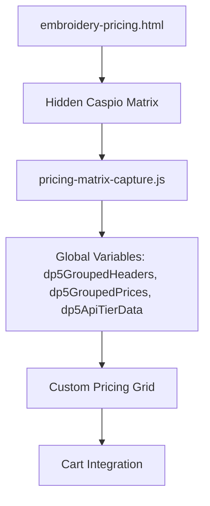
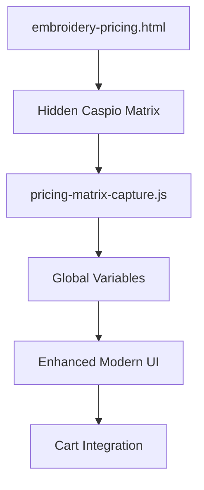

# Embroidery Pricing Page Redesign Plan

## 1. Current Implementation Analysis

The current embroidery pricing page uses a hidden Caspio pricing matrix that provides the pricing data while displaying a custom UI to the user. Here's how it works:



### Key Components

1. **Hidden Caspio Matrix**: 
   - Loaded in a div with ID "pricing-calculator"
   - Hidden with CSS but still functional in the background
   - Provides the pricing data for different size groups and quantity tiers

2. **Custom UI Elements**:
   - Product context area (image, title, style, color)
   - Tab navigation for different pricing pages
   - Color swatches for selecting different colors
   - Custom pricing grid showing prices for different size groups and quantity tiers
   - LTM (Less Than Minimum) fee information

3. **Brand Colors**:
   - Primary color: #2f661e (Main green)
   - Primary dark: #1e4d0f (Darker green for hover)
   - Primary light: #eaf2e9 (Lighter green for backgrounds/borders)
   - Secondary color: #5cb85c (Accent green)
   - Secondary light: #eaffea (Lighter green)
## 2. Current Implementation Challenges

Based on analysis, here are the key challenges with the current implementation:

1. **Hidden Caspio Matrix**: The current implementation hides the Caspio matrix but still loads it, which can impact page performance.
2. **Complex Data Flow**: The data flow from Caspio to the custom UI involves multiple steps and global variables.
3. **Limited Responsiveness**: While there are some responsive adjustments, the design could be improved for mobile devices.
4. **Visual Hierarchy**: The current design could benefit from better visual hierarchy to guide users through the pricing information.

## 3. Redesign Requirements

The client wants a modern, responsive design that:
- Maintains all the pricing data
- Presents it in a cleaner format
- Uses their brand colors (green palette)
- Hides the Caspio matrix but still uses its data in the background

## 4. Proposed Architecture

We recommend maintaining the current architecture with some improvements:


## 5. UI Design Recommendations

### 5.1 Overall Layout

We recommend a clean, card-based layout with clear sections:

```
+-----------------------------------------------+
|                 Header Section                |
+-----------------------------------------------+
|                                               |
|              Product Context Area             |
|                                               |
+-----------------------------------------------+
|                                               |
|               Tab Navigation                  |
|                                               |
+-----------------------------------------------+
|                                               |
|             Color Selection Area              |
|                                               |
+-----------------------------------------------+
|                                               |
|              Pricing Information              |
|                                               |
+-----------------------------------------------+
|                                               |
|             Additional Information            |
|                                               |
+-----------------------------------------------+
```

### 5.2 Color Scheme

We'll use the client's brand colors from main.css:

- Primary color: #2f661e (Main green)
- Primary dark: #1e4d0f (Darker green for hover)
- Primary light: #eaf2e9 (Lighter green for backgrounds/borders)
- Secondary color: #5cb85c (Accent green)
- Secondary light: #eaffea (Lighter green)
- Text color: #333 (Dark grey)
- Border color: #ddd (Light grey)

### 5.3 Component Redesign

#### Product Context Area

```html
<div class="product-context">
    <div class="product-image-container">
        
    </div>
    <div class="product-details">
        <h2 id="product-title">Product Title</h2>
        <div class="product-meta">
            <span class="meta-item">Style: <strong id="product-style">Style Number</strong></span>
            <span class="meta-item">Color: <strong id="product-color">Color Name</strong></span>
        </div>
        <a id="back-to-product" href="#" class="back-to-product">
            <span class="back-icon">←</span> Back to Product
        </a>
    </div>
</div>
```

#### Color Selection Area

```html
<div class="color-selection-section">
    <h3 class="section-title">Available Colors</h3>
    <div class="color-swatches-container">
        <div class="color-swatches" id="color-swatches">
            <!-- Color swatches will be dynamically added here -->
        </div>
    </div>
</div>
```

#### Pricing Grid

```html
<div class="pricing-section">
    <h3 class="section-title">Pricing Matrix</h3>
    <div class="pricing-grid-container">
        <table class="pricing-grid" id="custom-pricing-grid">
            <thead>
                <tr>
### 5.4 CSS Styling Recommendations

We recommend creating a new CSS file specifically for the redesigned embroidery pricing page that builds on the existing styling but modernizes it. Here's a sample of the key styling components:

```css
/* Variables from main.css */
:root {
    --primary-color: #2f661e;     /* Main green */
    --primary-dark: #1e4d0f;      /* Darker green for hover */
    --primary-light: #eaf2e9;     /* Lighter green for backgrounds/borders */
    --secondary-color: #5cb85c;   /* Accent green */
    --secondary-light: #eaffea;   /* Lighter green */
    --text-color: #333;           /* Main text color */
    --border-color: #ddd;         /* Standard border color */
    --background-light: #f8f8f8;  /* Light background */
    --white: #ffffff;             /* White */
    --shadow-sm: 0 2px 4px rgba(0,0,0,0.05);
    --shadow-md: 0 4px 8px rgba(0,0,0,0.1);
    --radius-sm: 4px;
    --radius-md: 8px;
    --spacing-sm: 10px;
    --spacing-md: 20px;
    --spacing-lg: 30px;
    --font-family: 'Segoe UI', Roboto, 'Helvetica Neue', Arial, sans-serif;
}

/* Container */
.container {
    max-width: 1200px;
    margin: 0 auto;
    padding: var(--spacing-md);
}

/* Product Context Area */
.product-context {
    display: flex;
    align-items: center;
    gap: var(--spacing-md);
    padding: var(--spacing-md);
    background-color: var(--white);
    border-radius: var(--radius-md);
    box-shadow: var(--shadow-md);
    margin-bottom: var(--spacing-md);
    border-left: 4px solid var(--primary-color);
}

.product-image-container {
    flex-shrink: 0;
}

.product-image {
    width: 120px;
    height: 120px;
    object-fit: contain;
    border: 1px solid var(--border-color);
    border-radius: var(--radius-sm);
    background-color: var(--white);
}

.product-details {
    flex: 1;
}

.product-details h2 {
    margin: 0 0 var(--spacing-sm) 0;
    color: var(--primary-color);
    font-size: 1.4em;
}

.product-meta {
    display: flex;
    flex-wrap: wrap;
    gap: var(--spacing-md);
    margin-bottom: var(--spacing-sm);
}

.meta-item {
    color: var(--text-color);
    font-size: 0.9em;
}

.back-to-product {
    display: inline-flex;
    align-items: center;
    color: var(--primary-color);
    text-decoration: none;
    font-weight: 500;
    font-size: 0.9em;
    padding: 6px 12px;
    border: 1px solid var(--primary-color);
    border-radius: var(--radius-sm);
    transition: all 0.2s ease;
}

.back-to-product:hover {
    background-color: var(--primary-color);
    color: var(--white);
}

.back-icon {
    margin-right: 5px;
}

/* Tab Navigation */
.pricing-tabs {
    display: flex;
    border-bottom: 1px solid var(--border-color);
    margin-bottom: var(--spacing-md);
    overflow-x: auto;
    scrollbar-width: thin;
}

.pricing-tab {
    padding: 12px 20px;
    white-space: nowrap;
    color: var(--text-color);
    text-decoration: none;
    border-bottom: 3px solid transparent;
    transition: all 0.2s ease;
}

.pricing-tab:hover {
    color: var(--primary-color);
    background-color: var(--primary-light);
}

.pricing-tab.active {
    color: var(--primary-color);
    border-bottom-color: var(--primary-color);
    font-weight: 600;
}

/* Section Titles */
.section-title {
    font-size: 1.2em;
    color: var(--primary-color);
    margin-top: 0;
    margin-bottom: var(--spacing-md);
    padding-bottom: var(--spacing-sm);
    border-bottom: 1px solid var(--primary-light);
}

/* Color Selection */
.color-selection-section {
    background-color: var(--white);
    border-radius: var(--radius-md);
    box-shadow: var(--shadow-md);
    padding: var(--spacing-md);
    margin-bottom: var(--spacing-md);
}

.color-swatches {
    display: flex;
    flex-wrap: wrap;
    gap: 15px;
}

.color-swatch {
    width: 60px;
    height: 60px;
    border-radius: 50%;
    cursor: pointer;
    border: 2px solid var(--border-color);
    transition: all 0.3s ease;
    position: relative;
}

.color-swatch:hover {
    transform: scale(1.1);
    border-color: var(--primary-color);
}

.color-swatch.active {
    border-color: var(--primary-color);
    box-shadow: 0 0 0 3px var(--primary-light);
}

.color-name {
    position: absolute;
    bottom: -25px;
    left: 50%;
    transform: translateX(-50%);
    font-size: 0.75em;
    white-space: nowrap;
    color: var(--text-color);
    text-align: center;
    width: 80px;
}

/* Pricing Section */
.pricing-section {
    background-color: var(--white);
    border-radius: var(--radius-md);
    box-shadow: var(--shadow-md);
    padding: var(--spacing-md);
    margin-bottom: var(--spacing-md);
}

.pricing-grid-container {
    overflow-x: auto;
}

.pricing-grid {
    width: 100%;
    border-collapse: separate;
    border-spacing: 0;
    border: 1px solid var(--primary-light);
    border-radius: var(--radius-sm);
    overflow: hidden;
}

.pricing-grid th {
    background-color: var(--primary-color);
    color: var(--white);
    padding: 12px;
    text-align: center;
}

.pricing-grid th:first-child {
    background-color: var(--primary-dark);
    text-align: left;
}

.pricing-grid td {
    padding: 12px;
    text-align: center;
    border-bottom: 1px solid var(--primary-light);
}

.pricing-grid td:first-child {
    text-align: left;
    font-weight: bold;
    background-color: var(--primary-light);
    color: var(--primary-dark);
}

.pricing-grid tr:hover td {
    background-color: var(--secondary-light);
}

.pricing-grid tr:last-child td {
    border-bottom: none;
}

.price-cell {
    display: flex;
    align-items: center;
    justify-content: center;
}

/* Inventory Indicator */
.inventory-indicator {
    display: inline-block;
    width: 10px;
    height: 10px;
    border-radius: 50%;
    margin-left: 5px;
}

.inventory-good {
    background-color: #28a745;
}

.inventory-low {
    background-color: #ffc107;
}

.inventory-none {
    background-color: #dc3545;
}

/* LTM Fee Container */
.pricing-notes {
    margin-top: var(--spacing-md);
}

.ltm-fee-container {
    background-color: var(--primary-light);
    border-radius: var(--radius-sm);
    padding: var(--spacing-md);
}

.ltm-fee-container h4 {
    margin-top: 0;
    margin-bottom: var(--spacing-sm);
    color: var(--primary-color);
    font-size: 1em;
}

.ltm-fee-container ul {
    margin: 0;
    padding-left: 20px;
}

.ltm-fee-container li {
    margin-bottom: 5px;
}

/* Additional Information */
.additional-info {
    background-color: var(--white);
    border-radius: var(--radius-md);
    box-shadow: var(--shadow-md);
    padding: var(--spacing-md);
    margin-bottom: var(--spacing-md);
## 6. JavaScript Enhancements

### 6.1 Improved Data Capture

The current pricing-matrix-capture.js script works well but could be enhanced:

```javascript
// Enhanced pricing matrix capture
function capturePricingMatrix(styleNumber, colorCode, embType) {
    console.log("[PRICING-MATRIX:CAPTURE] Starting enhanced capture");
    
    try {
        // Get the pricing table
        const pricingTable = document.querySelector('.matrix-price-table') || 
                            document.querySelector('.cbResultSetTable');
        
        if (!pricingTable) {
            console.error("[PRICING-MATRIX:CAPTURE-ERROR] No pricing table found");
            return;
        }
        
        // Extract headers (sizes)
        const headers = [];
        const headerRow = pricingTable.querySelector('tr');
        if (headerRow) {
            const headerCells = headerRow.querySelectorAll('th');
            headerCells.forEach((cell, index) => {
                if (index > 0) { // Skip the first header (Quantity Tier)
                    headers.push(cell.textContent.trim());
                }
            });
        }
        
        // Extract pricing data
        const pricingRows = [];
        const dataRows = pricingTable.querySelectorAll('tr:not(:first-child)');
        dataRows.forEach(row => {
            const cells = row.querySelectorAll('td');
            if (cells.length > 0) {
                const tierCell = cells[0];
                const tier = tierCell.textContent.trim();
                
                const prices = {};
                for (let i = 1; i < cells.length; i++) {
                    if (i - 1 < headers.length) {
                        const size = headers[i - 1];
                        const priceText = cells[i].textContent.trim();
                        const price = parseFloat(priceText.replace(/[^0-9.]/g, ''));
                        if (!isNaN(price)) {
                            prices[size] = price;
                        }
                    }
                }
                
                pricingRows.push({
                    tier: tier,
                    prices: prices
                });
            }
        });
        
        // Use a more structured approach to store the data
        const pricingData = {
            styleNumber,
            color: colorCode,
            embellishmentType: embType,
            headers,
            rows: pricingRows,
            capturedAt: new Date().toISOString()
        };
        
        // Store the data and dispatch an event
        window.dp5GroupedHeaders = headers;
        window.dp5GroupedPrices = formatPriceMatrix(headers, pricingRows);
        window.dp5ApiTierData = extractTierData(pricingRows);
        
        // Dispatch event for other components to react
        const event = new CustomEvent('pricingDataLoaded', {
            detail: pricingData
        });
        window.dispatchEvent(event);
        
        return pricingData;
    } catch (error) {
        console.error("[PRICING-MATRIX:CAPTURE-ERROR]", error);
        return null;
    }
}

// Helper function to extract tier data
function extractTierData(pricingRows) {
    const tiers = {};
    
    pricingRows.forEach(row => {
        const tierText = row.tier;
        let minQuantity = 0;
        let maxQuantity = null;
        let ltmFee = 0;
        
        // Parse tier text (e.g., "1-23", "24-47", "48-71", "72+")
        if (tierText.includes('-')) {
            const [min, max] = tierText.split('-').map(t => parseInt(t.trim()));
            minQuantity = min;
            maxQuantity = max;
            
            // Add LTM fee for lower tiers
            if (minQuantity === 1 && maxQuantity <= 11) {
                ltmFee = 50.00;
            } else if (minQuantity <= 12 && maxQuantity <= 23) {
                ltmFee = 25.00;
            }
        } else if (tierText.includes('+')) {
            minQuantity = parseInt(tierText.replace('+', '').trim());
        } else {
            // Try to parse as a single number
            minQuantity = parseInt(tierText.trim());
        }
        
        tiers[tierText] = {
            MinQuantity: minQuantity,
            MaxQuantity: maxQuantity,
            LTM_Fee: ltmFee > 0 ? ltmFee : undefined
        };
    });
    
    return tiers;
}

// Helper function to format price matrix for API
function formatPriceMatrix(headers, rows) {
    const result = {};
    
    // Create an object with size groups as keys
    headers.forEach(header => {
        result[header] = {};
    });
    
    // Add prices for each tier
    rows.forEach(row => {
        const tier = row.tier;
        
        // For each size group, add the price for this tier
        Object.keys(row.prices).forEach(size => {
            if (result[size]) {
                result[size][tier] = row.prices[size];
            }
        });
    });
    
    return result;
}
```

### 6.2 Responsive UI Updates

```javascript
// Function to update the pricing grid responsively
function updatePricingGrid() {
    // Get pricing data from global variables
    if (window.dp5GroupedHeaders && window.dp5GroupedPrices && window.dp5ApiTierData) {
        const pricingData = {
            headers: window.dp5GroupedHeaders,
            prices: window.dp5GroupedPrices,
            tiers: window.dp5ApiTierData
        };
        
        // Update the custom pricing grid
        const pricingGrid = document.getElementById('custom-pricing-grid');
        if (!pricingGrid) return;
        
        // Get the tbody element
        const tbody = pricingGrid.querySelector('tbody');
        if (!tbody) return;
        
        // Clear existing rows
        tbody.innerHTML = '';
        
        // Create rows for each tier
        const tierKeys = Object.keys(pricingData.tiers);
        tierKeys.forEach(tierKey => {
            const tier = pricingData.tiers[tierKey];
            const row = document.createElement('tr');
            
            // Create tier label cell
            const tierCell = document.createElement('td');
            let tierLabel = '';
            if (tier.MaxQuantity && tier.MinQuantity) {
                tierLabel = `${tier.MinQuantity}-${tier.MaxQuantity}`;
            } else if (tier.MinQuantity) {
                tierLabel = `${tier.MinQuantity}+`;
            }
            tierCell.textContent = tierLabel;
            row.appendChild(tierCell);
            
            // Create price cells for each size group
            pricingData.headers.forEach(sizeGroup => {
                const priceCell = document.createElement('td');
                priceCell.className = 'price-cell';
                
                // Get price for this tier and size group
                const price = pricingData.prices[sizeGroup] ?
                    pricingData.prices[sizeGroup][tierKey] : null;
                
                if (price !== null && price !== undefined) {
                    // Format price
                    const formattedPrice = `$${parseFloat(price).toFixed(2)}`;
                    priceCell.innerHTML = formattedPrice;
                    
                    // Add inventory indicator if available
                    if (window.inventoryData && window.inventoryData.sizes) {
                        addInventoryIndicator(priceCell, sizeGroup, window.inventoryData);
                    }
                } else {
                    priceCell.textContent = 'N/A';
                }
                
                row.appendChild(priceCell);
            });
            
            tbody.appendChild(row);
        });
        
        // Update LTM fee information
        updateLTMFeeDisplay(pricingData.tiers);
    }
}

// Function to add inventory indicator
function addInventoryIndicator(priceCell, size, inventoryData) {
    // Check inventory for this specific size
    const sizeIndex = inventoryData.sizes.indexOf(size);
    let inventory = 0;
    
    if (sizeIndex !== -1) {
        // Get inventory for this size
        inventory = inventoryData.sizeTotals[sizeIndex];
    }
    
    // Create inventory indicator
    const indicator = document.createElement('span');
    indicator.className = 'inventory-indicator';
    
    if (lowestInventory === 0 || lowestInventory === Infinity) {
        indicator.classList.add('inventory-none');
        indicator.title = 'Out of stock';
    } else if (lowestInventory < 10) {
        indicator.classList.add('inventory-low');
        indicator.title = `Low stock: ${lowestInventory} available`;
    } else {
        indicator.classList.add('inventory-good');
        indicator.title = `In stock: ${lowestInventory} available`;
    }
    
    priceCell.appendChild(indicator);
}

// Function to handle color swatch click
function handleColorSwatchClick(swatch) {
    console.log("Color swatch clicked:", swatch);
    
    // Update selected color
    window.selectedColor = swatch;
    
    // Update active swatch styling
    const allSwatches = document.querySelectorAll('.color-swatch');
    allSwatches.forEach(s => s.classList.remove('active'));
    
    // Find the swatch element that matches this color and activate it
    const matchingSwatch = Array.from(allSwatches).find(s =>
        s.dataset.colorName === swatch.COLOR_NAME);
    if (matchingSwatch) {
        matchingSwatch.classList.add('active');
    }
    
    // Update product color display
    const colorSpan = document.getElementById('product-color');
    if (colorSpan) {
        colorSpan.textContent = swatch.COLOR_NAME;
    }
    
    // Update global variables for other scripts
    window.selectedColorName = swatch.COLOR_NAME;
    window.selectedCatalogColor = swatch.CATALOG_COLOR;
    
    // Load inventory data for this color
    loadInventoryData(swatch.CATALOG_COLOR || swatch.COLOR_NAME);
    
    // Update pricing grid with this color's data
    updatePricingGrid();
    
    // Update Caspio pricing data (hidden but needed for cart)
    updateCaspioPricing(swatch.CATALOG_COLOR || swatch.COLOR_NAME);
}

// Function to handle mobile-specific adjustments
function handleMobileAdjustments() {
    const isMobile = window.innerWidth <= 768;
    const isSmallMobile = window.innerWidth <= 480;
    
    // Adjust color swatches for mobile
    const colorSwatches = document.querySelectorAll('.color-swatch');
    colorSwatches.forEach(swatch => {
        if (isSmallMobile) {
            swatch.style.width = '45px';
            swatch.style.height = '45px';
        } else if (isMobile) {
            swatch.style.width = '50px';
            swatch.style.height = '50px';
        } else {
            swatch.style.width = '60px';
            swatch.style.height = '60px';
        }
    });
    
    // Adjust pricing grid for mobile
    const pricingGrid = document.getElementById('custom-pricing-grid');
    if (pricingGrid) {
        if (isMobile) {
## 7. Implementation Strategy

We recommend implementing this redesign in the following phases:

### Phase 1: Setup and Structure
1. Create a new CSS file for the redesigned page
2. Update the HTML structure while maintaining the hidden Caspio matrix
3. Ensure all necessary elements for cart integration are preserved

### Phase 2: Styling and Responsiveness
1. Apply the new CSS styles to all components
2. Test responsiveness across different device sizes
3. Ensure the color scheme is consistently applied

### Phase 3: JavaScript Enhancements
1. Update the JavaScript functions to work with the new UI
2. Enhance the data capture and display logic
3. Improve error handling and fallbacks

### Phase 4: Testing and Optimization
1. Test the page with different products and colors
2. Verify that all pricing data is correctly displayed
3. Ensure cart integration works properly
4. Optimize performance by minimizing DOM manipulations

## 8. Technical Considerations

### Performance Optimization
- Load the Caspio matrix asynchronously to prevent blocking the main UI
- Use event delegation for color swatch clicks to reduce event listeners
- Implement lazy loading for color swatch images

### Browser Compatibility
- Ensure CSS variables have fallbacks for older browsers
- Test in Chrome, Firefox, Safari, and Edge
- Use feature detection where necessary

### Accessibility
- Ensure proper color contrast for text elements
- Add ARIA attributes to interactive elements
- Ensure keyboard navigation works for all interactive elements

## 9. Conclusion

This redesign plan maintains the current functionality while providing a more modern, responsive, and user-friendly interface. The key improvements are:

1. **Enhanced Visual Design**: Using the client's brand colors in a more cohesive way
2. **Improved Responsiveness**: Better adaptation to different screen sizes
3. **Clearer Information Hierarchy**: Making pricing information more accessible
4. **Maintained Functionality**: Preserving all existing features while improving the UI

The implementation can be done incrementally, allowing for testing and feedback at each stage.
            pricingGrid.classList.add('mobile-view');
        } else {
            pricingGrid.classList.remove('mobile-view');
        }
    }
}
```
}

.additional-info h3 {
    color: var(--primary-color);
    margin-top: 0;
    margin-bottom: var(--spacing-sm);
    font-size: 1.2em;
}

.faq-item {
    margin-bottom: var(--spacing-md);
}

.faq-item h4 {
    color: var(--primary-dark);
    margin-bottom: var(--spacing-sm);
    font-size: 1em;
}

/* Hide the original Caspio pricing matrix */
#pricing-calculator {
    position: absolute;
    left: -9999px;
    visibility: hidden;
    height: 1px;
    overflow: hidden;
}

/* Responsive Design */
@media (max-width: 768px) {
    .product-context {
        flex-direction: column;
        text-align: center;
    }
    
    .product-image {
        margin-bottom: var(--spacing-sm);
    }
    
    .product-meta {
        justify-content: center;
    }
    
    .pricing-grid {
        font-size: 0.9em;
    }
    
    .pricing-grid th,
    .pricing-grid td {
        padding: 8px 5px;
    }
    
    .color-swatches {
        justify-content: center;
    }
}

@media (max-width: 480px) {
    .pricing-tabs {
        flex-wrap: nowrap;
        overflow-x: auto;
    }
    
    .pricing-tab {
        padding: 10px 15px;
        font-size: 0.9em;
    }
    
    .pricing-grid {
        font-size: 0.8em;
    }
    
    .pricing-grid th,
    .pricing-grid td {
        padding: 6px 4px;
    }
    
    .section-title {
        font-size: 1.1em;
    }
}
```
                    <th>Quantity</th>
                    <th>XS</th>
                    <th>S</th>
                    <th>M</th>
                    <th>L</th>
                    <th>XL</th>
                    <th>2XL</th>
                    <th>3XL</th>
                    <th>4XL</th>
                </tr>
            </thead>
            <tbody>
                <!-- Pricing data will be dynamically added here -->
            </tbody>
        </table>
        
        <div class="pricing-notes">
            <div class="ltm-fee-container">
                <h4>Less Than Minimum (LTM) Fees:</h4>
                <ul>
                    <li>1-11 pieces: $50.00 fee</li>
                    <li>12-23 pieces: $25.00 fee</li>
                </ul>
            </div>
        </div>
    </div>
</div>
```

The key difference will be in the UI layer, which will be completely redesigned for better user experience while maintaining the same data flow.

## 10. Add to Cart Functionality

To enhance the user experience, we'll add an "Add to Cart" section that allows users to select quantities for each size:

```html
<div class="add-to-cart-section">
    <h3 class="section-title">Add to Cart</h3>
    <div class="size-quantity-grid">
        <!-- Size quantity inputs will be dynamically generated -->
        <div class="size-quantity-row">
            <div class="size-label">S</div>
            <div class="quantity-input-container">
                <button class="quantity-btn decrease">-</button>
                <input type="number" class="quantity-input" data-size="S" min="0" value="0">
                <button class="quantity-btn increase">+</button>
            </div>
            <div class="size-price" data-size="S">$0.00</div>
        </div>
        <!-- More size rows will be added dynamically -->
    </div>
    
    <div class="cart-summary">
        <div class="cart-total">
            <span class="total-label">Total:</span>
            <span class="total-amount">$0.00</span>
        </div>
        <div class="ltm-fee-notice" style="display: none;">
            <span class="ltm-icon">⚠️</span>
            <span class="ltm-text">Less Than Minimum fee applies</span>
        </div>
        <button id="add-to-cart-button" class="add-to-cart-button">
            Add to Cart
        </button>
    </div>
</div>
```

### 10.1 Add to Cart JavaScript

```javascript
// Function to initialize the Add to Cart section
function initAddToCart() {
    // Get the container for size quantity inputs
    const sizeQuantityGrid = document.querySelector('.size-quantity-grid');
    if (!sizeQuantityGrid) return;
    
    // Clear existing content
    sizeQuantityGrid.innerHTML = '';
    
    // Get available sizes from pricing data
    const sizes = window.dp5UniqueSizes || [];
    if (!sizes.length) return;
    
    // Create input rows for each size
    sizes.forEach(size => {
        const row = document.createElement('div');
        row.className = 'size-quantity-row';
        
        // Size label
        const sizeLabel = document.createElement('div');
        sizeLabel.className = 'size-label';
        sizeLabel.textContent = size;
        
        // Quantity input with +/- buttons
        const inputContainer = document.createElement('div');
        inputContainer.className = 'quantity-input-container';
        
        const decreaseBtn = document.createElement('button');
        decreaseBtn.className = 'quantity-btn decrease';
        decreaseBtn.textContent = '-';
        decreaseBtn.addEventListener('click', () => {
            const input = inputContainer.querySelector('input');
            const currentValue = parseInt(input.value) || 0;
            if (currentValue > 0) {
                input.value = currentValue - 1;
                input.dispatchEvent(new Event('change'));
            }
        });
        
        const input = document.createElement('input');
        input.type = 'number';
        input.className = 'quantity-input';
        input.dataset.size = size;
        input.min = '0';
        input.value = '0';
        input.addEventListener('change', updateCartTotal);
        
        const increaseBtn = document.createElement('button');
        increaseBtn.className = 'quantity-btn increase';
        increaseBtn.textContent = '+';
        increaseBtn.addEventListener('click', () => {
            const input = inputContainer.querySelector('input');
            const currentValue = parseInt(input.value) || 0;
            input.value = currentValue + 1;
            input.dispatchEvent(new Event('change'));
        });
        
        inputContainer.appendChild(decreaseBtn);
        inputContainer.appendChild(input);
        inputContainer.appendChild(increaseBtn);
        
        // Price display for this size
        const priceDisplay = document.createElement('div');
        priceDisplay.className = 'size-price';
        priceDisplay.dataset.size = size;
        priceDisplay.textContent = '$0.00';
        
        // Add elements to row
        row.appendChild(sizeLabel);
        row.appendChild(inputContainer);
        row.appendChild(priceDisplay);
        
        // Add row to grid
        sizeQuantityGrid.appendChild(row);
    });
    
    // Initialize Add to Cart button
    const addToCartButton = document.getElementById('add-to-cart-button');
    if (addToCartButton) {
        addToCartButton.addEventListener('click', handleAddToCart);
    }
}

// Function to update cart total when quantities change
function updateCartTotal() {
    // Get all quantity inputs
    const quantityInputs = document.querySelectorAll('.quantity-input');
    let totalQuantity = 0;
    let totalPrice = 0;
    
    // Calculate total quantity
    quantityInputs.forEach(input => {
        const quantity = parseInt(input.value) || 0;
        totalQuantity += quantity;
    });
    
    // Determine pricing tier based on total quantity
    let tierKey = '';
    if (totalQuantity >= 72) {
        tierKey = '72+';
    } else if (totalQuantity >= 48) {
        tierKey = '48-71';
    } else if (totalQuantity >= 24) {
        tierKey = '24-47';
    } else if (totalQuantity >= 12) {
        tierKey = '12-23';
    } else if (totalQuantity > 0) {
        tierKey = '1-11';
    }
    
    // Check if LTM fee applies
    const ltmFeeNotice = document.querySelector('.ltm-fee-notice');
    let ltmFeeApplies = false;
    let ltmFee = 0;
    
    if (totalQuantity > 0 && totalQuantity < 24 && window.dp5ApiTierData) {
        const tierData = window.dp5ApiTierData[tierKey];
        if (tierData && tierData.LTM_Fee) {
            ltmFeeApplies = true;
            ltmFee = tierData.LTM_Fee;
        }
    }
    
    if (ltmFeeNotice) {
        ltmFeeNotice.style.display = ltmFeeApplies ? 'block' : 'none';
    }
    
    // Calculate price for each size and update displays
    quantityInputs.forEach(input => {
        const size = input.dataset.size;
        const quantity = parseInt(input.value) || 0;
        const priceDisplay = document.querySelector(`.size-price[data-size="${size}"]`);
        
        if (quantity > 0 && window.dp5GroupedPrices && window.dp5GroupedPrices[size] && window.dp5GroupedPrices[size][tierKey]) {
            const unitPrice = window.dp5GroupedPrices[size][tierKey];
            const itemTotal = quantity * unitPrice;
            totalPrice += itemTotal;
            
            if (priceDisplay) {
                priceDisplay.textContent = `$${itemTotal.toFixed(2)}`;
            }
        } else {
            if (priceDisplay) {
                priceDisplay.textContent = '$0.00';
            }
        }
    });
    
    // Add LTM fee if applicable
    if (ltmFeeApplies) {
        totalPrice += ltmFee;
    }
    
    // Update total display
    const totalAmountDisplay = document.querySelector('.total-amount');
    if (totalAmountDisplay) {
        totalAmountDisplay.textContent = `$${totalPrice.toFixed(2)}`;
    }
}

// Function to handle Add to Cart button click
function handleAddToCart() {
    // Get all quantity inputs
    const quantityInputs = document.querySelectorAll('.quantity-input');
    const sizes = [];
    let totalQuantity = 0;
    
    // Collect size and quantity data
    quantityInputs.forEach(input => {
        const size = input.dataset.size;
        const quantity = parseInt(input.value) || 0;
        
        if (quantity > 0) {
            sizes.push({
                size: size,
                quantity: quantity
            });
            totalQuantity += quantity;
        }
    });
    
    // Check if any sizes were selected
    if (sizes.length === 0) {
        alert('Please select at least one size and quantity.');
        return;
    }
    
    // Get product info
    const styleNumber = getUrlParameter('StyleNumber');
    const colorCode = getUrlParameter('COLOR');
    const embType = detectEmbellishmentType();
    
    // Create product data object
    const productData = {
        styleNumber: styleNumber,
        color: colorCode,
        embellishmentType: embType,
        sizes: sizes
    };
    
    // Add to cart using NWCACart if available
    if (window.NWCACart && typeof window.NWCACart.addToCart === 'function') {
        window.NWCACart.addToCart(productData)
            .then(result => {
                if (result.success) {
                    // Show success message
                    alert('Items added to cart successfully!');
                    
                    // Reset quantity inputs
                    quantityInputs.forEach(input => {
                        input.value = '0';
                    });
                    
                    // Update cart total
                    updateCartTotal();
                } else {
                    alert('Error adding to cart: ' + (result.error || 'Unknown error'));
                }
            })
            .catch(error => {
                alert('Error adding to cart: ' + error.message);
            });
    } else {
        alert('Cart system not available. Please try again later.');
    }
}

// Helper function to get URL parameter
function getUrlParameter(name) {
    const urlParams = new URLSearchParams(window.location.search);
    return urlParams.get(name);
}
```

### 10.2 Add to Cart Styling

```css
/* Add to Cart Section */
.add-to-cart-section {
    background-color: var(--white);
    border-radius: var(--radius-md);
    box-shadow: var(--shadow-md);
    padding: var(--spacing-md);
    margin-bottom: var(--spacing-md);
}

.size-quantity-grid {
    display: grid;
    grid-template-columns: repeat(auto-fill, minmax(250px, 1fr));
    gap: 15px;
    margin-bottom: var(--spacing-md);
}

.size-quantity-row {
    display: flex;
    align-items: center;
    padding: 10px;
    background-color: var(--primary-light);
    border-radius: var(--radius-sm);
}

.size-label {
    font-weight: bold;
    width: 40px;
    text-align: center;
    color: var(--primary-dark);
}

.quantity-input-container {
    display: flex;
    align-items: center;
    margin: 0 10px;
}

.quantity-btn {
    width: 30px;
    height: 30px;
    border: 1px solid var(--primary-color);
    background-color: var(--white);
    color: var(--primary-color);
    font-weight: bold;
    cursor: pointer;
    display: flex;
    align-items: center;
    justify-content: center;
    transition: all 0.2s ease;
}

.quantity-btn:hover {
    background-color: var(--primary-color);
    color: var(--white);
}

.quantity-btn.decrease {
    border-radius: var(--radius-sm) 0 0 var(--radius-sm);
}

.quantity-btn.increase {
    border-radius: 0 var(--radius-sm) var(--radius-sm) 0;
}

.quantity-input {
    width: 50px;
    height: 30px;
    border: 1px solid var(--primary-color);
    border-left: none;
    border-right: none;
    text-align: center;
    font-size: 1em;
}

.size-price {
    flex: 1;
    text-align: right;
    font-weight: bold;
    color: var(--primary-color);
}

.cart-summary {
    background-color: var(--primary-light);
    padding: var(--spacing-md);
    border-radius: var(--radius-sm);
    margin-top: var(--spacing-md);
}

.cart-total {
    display: flex;
    justify-content: space-between;
    font-size: 1.2em;
    font-weight: bold;
    margin-bottom: var(--spacing-sm);
}

.ltm-fee-notice {
    background-color: #fff3cd;
    color: #856404;
    padding: 8px 12px;
    border-radius: var(--radius-sm);
    margin-bottom: var(--spacing-md);
    display: flex;
    align-items: center;
}

.ltm-icon {
    margin-right: 8px;
}

.add-to-cart-button {
    background-color: var(--primary-color);
    color: var(--white);
    border: none;
    border-radius: var(--radius-sm);
    padding: 12px 24px;
    font-size: 1.1em;
    font-weight: bold;
    cursor: pointer;
    width: 100%;
    transition: all 0.2s ease;
}

.add-to-cart-button:hover {
    background-color: var(--primary-dark);
    transform: translateY(-2px);
    box-shadow: var(--shadow-md);
}

@media (max-width: 768px) {
    .size-quantity-grid {
        grid-template-columns: 1fr;
    }
}
```

This add-to-cart functionality will allow users to:
1. Select quantities for each individual size
2. See real-time price updates based on quantity
3. Be notified of LTM fees when applicable
4. Add items to the cart with specific size breakdowns