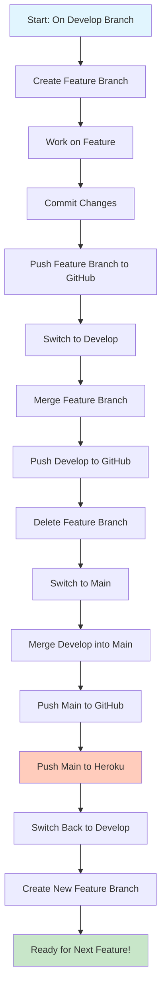
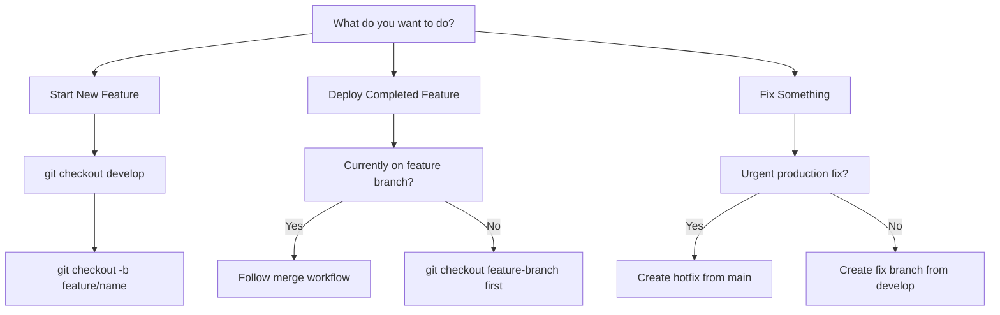

# Git Workflow Visual Guide

## Workflow Diagram



## Step-by-Step Visual Breakdown

### 📍 Current State Check
```
develop branch ──┐
                 ├─→ git status (should be clean)
                 └─→ git pull origin develop
```

### 🌿 Feature Branch Creation
```
develop ──────→ feature/new-calculator
         git checkout -b
```

### 💻 Development Flow
```
feature/new-calculator
    │
    ├─→ Make changes
    ├─→ git add .
    ├─→ git commit -m "message"
    └─→ git push origin feature/new-calculator
```

### 🔄 Merge Process
```
feature/new-calculator ──┐
                         ├─→ develop (merge)
develop ─────────────────┘
    │
    └─→ git push origin develop
```

### 🗑️ Cleanup
```
Local:  git branch -d feature/new-calculator
Remote: git push origin --delete feature/new-calculator
```

### 🚀 Production Deployment
```
develop ──────→ main (merge)
                  │
                  ├─→ GitHub (git push origin main)
                  └─→ Heroku (git push heroku main)
```

### 🔁 New Cycle
```
main ──→ develop ──→ feature/next-feature
```

## Command Flow Chart

```mermaid
flowchart LR
    subgraph "1. Setup"
        A1[git checkout develop]
        A2[git pull origin develop]
        A1 --> A2
    end
    
    subgraph "2. Feature Work"
        B1[git checkout -b feature-name]
        B2[Make changes]
        B3[git add .]
        B4[git commit -m 'message']
        B5[git push origin feature-name]
        B1 --> B2 --> B3 --> B4 --> B5
    end
    
    subgraph "3. Integration"
        C1[git checkout develop]
        C2[git merge feature-name]
        C3[git push origin develop]
        C1 --> C2 --> C3
    end
    
    subgraph "4. Deployment"
        D1[git checkout main]
        D2[git merge develop]
        D3[git push origin main]
        D4[git push heroku main]
        D1 --> D2 --> D3 --> D4
    end
    
    A2 --> B1
    B5 --> C1
    C3 --> D1
    D4 --> E[git checkout develop]
```



## Branch Timeline Visualization

```
main     : ────────────────●───────────────●─────→
                           ↑               ↑
develop  : ──────●─────────┴───●───────────┴─────→
                 ↑             ↑
feature  : ──────┴─────────────┘ (deleted)

● = commit/merge point
→ = ongoing development
```

## Quick Decision Tree



## Status Indicators

### ✅ Ready to Deploy
- All tests passing
- Feature branch pushed to GitHub
- No merge conflicts with develop

### ⚠️ Need Attention
- Uncommitted changes (`git status` shows modified files)
- Behind remote (`git pull` needed)
- Merge conflicts present

### 🚫 Stop and Fix
- On wrong branch for operation
- Heroku deployment failed
- Git push rejected

## Emergency Commands

### 🔙 Undo Last Commit (before push)
```bash
git reset --soft HEAD~1
```

### 🔄 Abort Merge
```bash
git merge --abort
```

### 📌 Stash Changes Temporarily
```bash
git stash
# ... do other work ...
git stash pop
```

### 🏷️ Tag a Release
```bash
git tag -a v104 -m "Version 104: Customer calculator"
git push origin v104